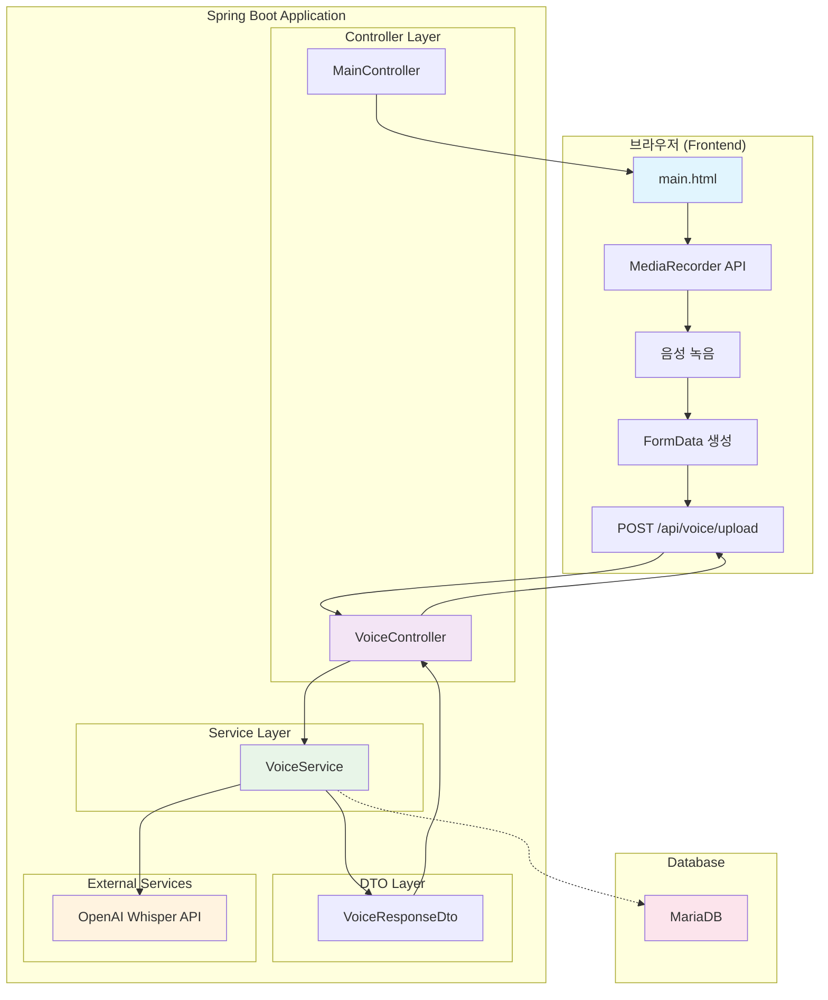
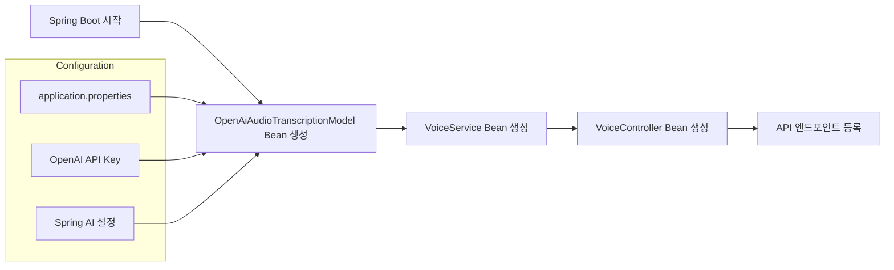
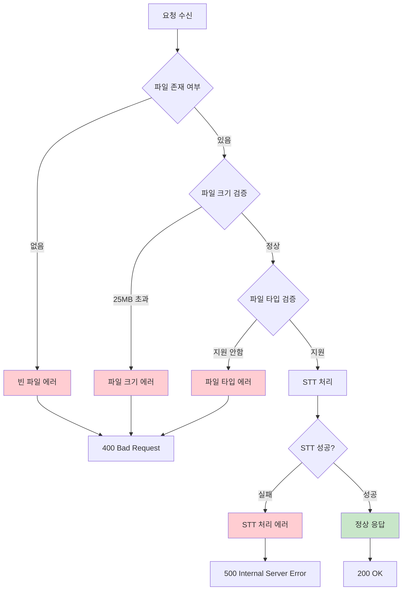
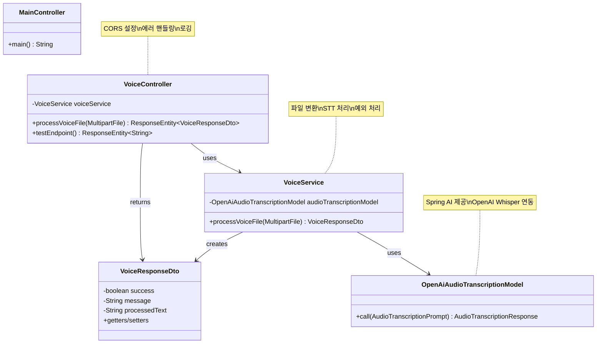
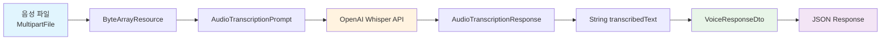

# Spring AI Diary Worker - 전체 코드 흐름

## 시스템 아키텍처 개요



## 상세 코드 흐름

### 1. 프론트엔드 흐름
```mermaid
graph LR
    A[사용자 음성 녹음 시작] --> B[MediaRecorder.start()]
    B --> C[음성 데이터 수집]
    C --> D[녹음 중지]
    D --> E[Blob 생성]
    E --> F[FormData에 파일 추가]
    F --> G[fetch API로 서버 전송]
    G --> H[응답 처리 및 화면 표시]
```

### 2. 백엔드 API 흐름
```mermaid
graph TD
    A[POST /api/voice/upload] --> B{파일 검증}
    B -->|유효| C[VoiceService.processVoiceFile()]
    B -->|무효| D[400 Bad Request]

    C --> E[MultipartFile → ByteArrayResource 변환]
    E --> F[AudioTranscriptionPrompt 생성]
    F --> G[OpenAI Whisper API 호출]
    G --> H{STT 처리 성공?}

    H -->|성공| I[VoiceResponseDto 성공 응답 생성]
    H -->|실패| J[VoiceResponseDto 실패 응답 생성]

    I --> K[200 OK 응답]
    J --> L[400/500 Error 응답]

    style A fill:#e3f2fd
    style C fill:#e8f5e8
    style G fill:#fff3e0
    style I fill:#e1f5fe
    style J fill:#ffebee
```

### 3. 의존성 주입 흐름


### 4. 에러 처리 흐름


## 주요 컴포넌트 관계도



## 데이터 흐름

