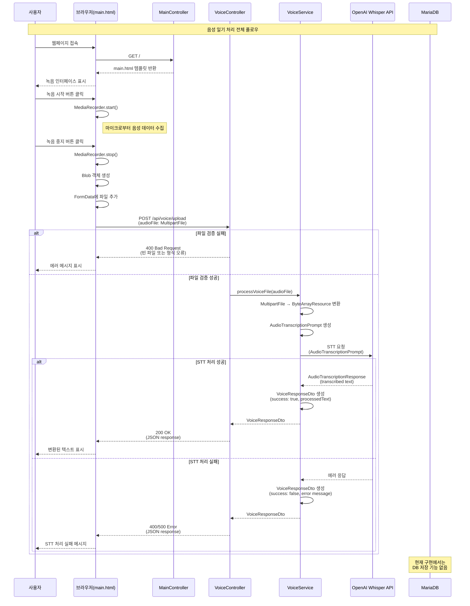
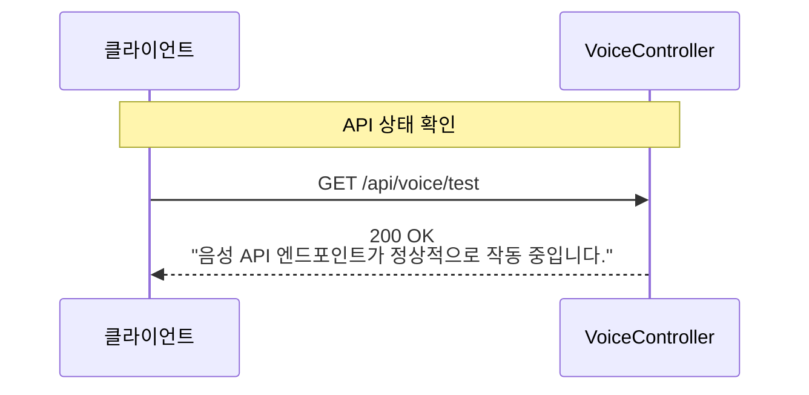
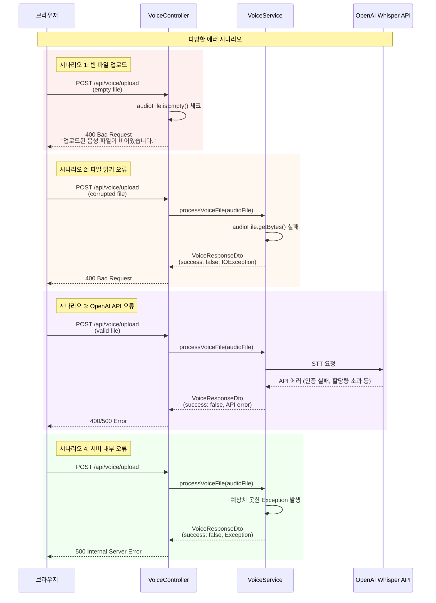
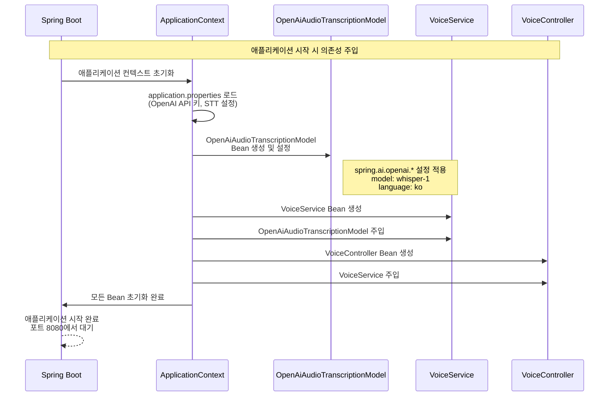
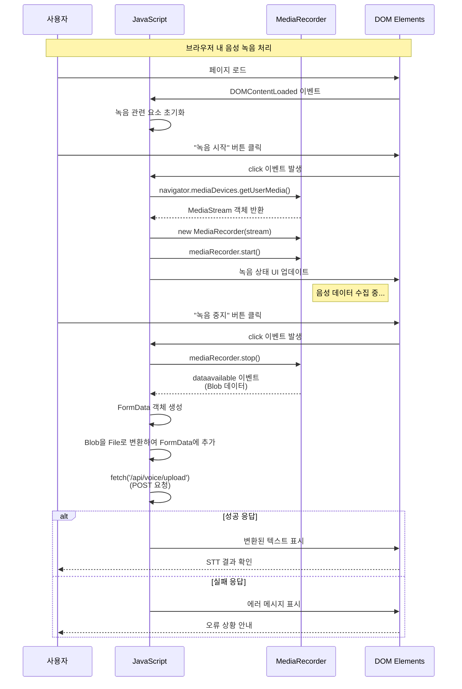
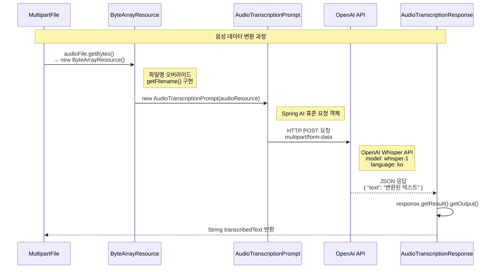

# Spring AI Diary Worker - 메인 기능 시퀀스 다이어그램

## 1. 전체 음성 처리 플로우

```mermaid
sequenceDiagram
    participant U as 사용자
    participant B as 브라우저(main.html)
    participant MC as MainController
    participant VC as VoiceController
    participant VS as VoiceService
    participant AI as OpenAI Whisper API
    participant DB as MariaDB

    Note over U,DB: 음성 일기 처리 전체 플로우

    U->>B: 웹페이지 접속
    B->>MC: GET /
    MC-->>B: main.html 템플릿 반환
    B-->>U: 녹음 인터페이스 표시

    U->>B: 녹음 시작 버튼 클릭
    B->>B: MediaRecorder.start()
    Note right of B: 마이크로부터 음성 데이터 수집

    U->>B: 녹음 중지 버튼 클릭
    B->>B: MediaRecorder.stop()
    B->>B: Blob 객체 생성
    B->>B: FormData에 파일 추가

    B->>VC: POST /api/voice/upload<br/>(audioFile: MultipartFile)

    alt 파일 검증 실패
        VC-->>B: 400 Bad Request<br/>(빈 파일 또는 형식 오류)
        B-->>U: 에러 메시지 표시
    else 파일 검증 성공
        VC->>VS: processVoiceFile(audioFile)

        VS->>VS: MultipartFile → ByteArrayResource 변환
        VS->>VS: AudioTranscriptionPrompt 생성

        VS->>AI: STT 요청<br/>(AudioTranscriptionPrompt)

        alt STT 처리 성공
            AI-->>VS: AudioTranscriptionResponse<br/>(transcribed text)
            VS->>VS: VoiceResponseDto 생성<br/>(success: true, processedText)
            VS-->>VC: VoiceResponseDto
            VC-->>B: 200 OK<br/>(JSON response)
            B-->>U: 변환된 텍스트 표시
        else STT 처리 실패
            AI-->>VS: 에러 응답
            VS->>VS: VoiceResponseDto 생성<br/>(success: false, error message)
            VS-->>VC: VoiceResponseDto
            VC-->>B: 400/500 Error<br/>(JSON response)
            B-->>U: STT 처리 실패 메시지
        end
    end

    Note over DB: 현재 구현에서는<br/>DB 저장 기능 없음
```

## 2. API 헬스체크 플로우

```mermaid
sequenceDiagram
    participant C as 클라이언트
    participant VC as VoiceController

    Note over C,VC: API 상태 확인

    C->>VC: GET /api/voice/test
    VC-->>C: 200 OK<br/>"음성 API 엔드포인트가 정상적으로 작동 중입니다."
```

## 3. 에러 처리 시나리오

```mermaid
sequenceDiagram
    participant B as 브라우저
    participant VC as VoiceController
    participant VS as VoiceService
    participant AI as OpenAI Whisper API

    Note over B,AI: 다양한 에러 시나리오

    rect rgb(255, 240, 240)
        Note right of B: 시나리오 1: 빈 파일 업로드
        B->>VC: POST /api/voice/upload<br/>(empty file)
        VC->>VC: audioFile.isEmpty() 체크
        VC-->>B: 400 Bad Request<br/>"업로드된 음성 파일이 비어있습니다."
    end

    rect rgb(255, 248, 240)
        Note right of B: 시나리오 2: 파일 읽기 오류
        B->>VC: POST /api/voice/upload<br/>(corrupted file)
        VC->>VS: processVoiceFile(audioFile)
        VS->>VS: audioFile.getBytes() 실패
        VS-->>VC: VoiceResponseDto<br/>(success: false, IOException)
        VC-->>B: 400 Bad Request
    end

    rect rgb(248, 240, 255)
        Note right of B: 시나리오 3: OpenAI API 오류
        B->>VC: POST /api/voice/upload<br/>(valid file)
        VC->>VS: processVoiceFile(audioFile)
        VS->>AI: STT 요청
        AI-->>VS: API 에러 (인증 실패, 할당량 초과 등)
        VS-->>VC: VoiceResponseDto<br/>(success: false, API error)
        VC-->>B: 400/500 Error
    end

    rect rgb(240, 255, 240)
        Note right of B: 시나리오 4: 서버 내부 오류
        B->>VC: POST /api/voice/upload
        VC->>VS: processVoiceFile(audioFile)
        VS->>VS: 예상치 못한 Exception 발생
        VS-->>VC: VoiceResponseDto<br/>(success: false, Exception)
        VC-->>B: 500 Internal Server Error
    end
```

## 4. Spring AI 의존성 주입 및 설정 플로우

```mermaid
sequenceDiagram
    participant SB as Spring Boot
    participant AC as ApplicationContext
    participant OA as OpenAiAudioTranscriptionModel
    participant VS as VoiceService
    participant VC as VoiceController

    Note over SB,VC: 애플리케이션 시작 시 의존성 주입

    SB->>AC: 애플리케이션 컨텍스트 초기화

    AC->>AC: application.properties 로드<br/>(OpenAI API 키, STT 설정)

    AC->>OA: OpenAiAudioTranscriptionModel<br/>Bean 생성 및 설정
    Note right of OA: spring.ai.openai.* 설정 적용<br/>model: whisper-1<br/>language: ko

    AC->>VS: VoiceService Bean 생성
    AC->>VS: OpenAiAudioTranscriptionModel 주입

    AC->>VC: VoiceController Bean 생성
    AC->>VC: VoiceService 주입

    AC->>SB: 모든 Bean 초기화 완료
    SB-->>SB: 애플리케이션 시작 완료<br/>포트 8080에서 대기
```

## 5. 프론트엔드 JavaScript 이벤트 플로우

```mermaid
sequenceDiagram
    participant U as 사용자
    participant JS as JavaScript
    participant MR as MediaRecorder
    participant DOM as DOM Elements

    Note over U,DOM: 브라우저 내 음성 녹음 처리

    U->>DOM: 페이지 로드
    DOM->>JS: DOMContentLoaded 이벤트
    JS->>JS: 녹음 관련 요소 초기화

    U->>DOM: "녹음 시작" 버튼 클릭
    DOM->>JS: click 이벤트 발생
    JS->>MR: navigator.mediaDevices.getUserMedia()
    MR-->>JS: MediaStream 객체 반환
    JS->>MR: new MediaRecorder(stream)
    JS->>MR: mediaRecorder.start()
    JS->>DOM: 녹음 상태 UI 업데이트

    Note right of MR: 음성 데이터 수집 중...

    U->>DOM: "녹음 중지" 버튼 클릭
    DOM->>JS: click 이벤트 발생
    JS->>MR: mediaRecorder.stop()
    MR-->>JS: dataavailable 이벤트<br/>(Blob 데이터)

    JS->>JS: FormData 객체 생성
    JS->>JS: Blob을 File로 변환하여 FormData에 추가

    JS->>JS: fetch('/api/voice/upload')<br/>(POST 요청)

    alt 성공 응답
        JS->>DOM: 변환된 텍스트 표시
        DOM-->>U: STT 결과 확인
    else 실패 응답
        JS->>DOM: 에러 메시지 표시
        DOM-->>U: 오류 상황 안내
    end
```

## 6. 데이터 변환 과정 상세

```mermaid
sequenceDiagram
    participant MF as MultipartFile
    participant BAR as ByteArrayResource
    participant ATP as AudioTranscriptionPrompt
    participant OAI as OpenAI API
    participant ATR as AudioTranscriptionResponse

    Note over MF,ATR: 음성 데이터 변환 과정

    MF->>BAR: audioFile.getBytes()<br/>→ new ByteArrayResource()
    Note right of BAR: 파일명 오버라이드<br/>getFilename() 구현

    BAR->>ATP: new AudioTranscriptionPrompt(audioResource)
    Note right of ATP: Spring AI 표준 요청 객체

    ATP->>OAI: HTTP POST 요청<br/>multipart/form-data
    Note right of OAI: OpenAI Whisper API<br/>model: whisper-1<br/>language: ko

    OAI-->>ATR: JSON 응답<br/>{ "text": "변환된 텍스트" }

    ATR->>ATR: response.getResult().getOutput()
    ATR-->>MF: String transcribedText 반환
```